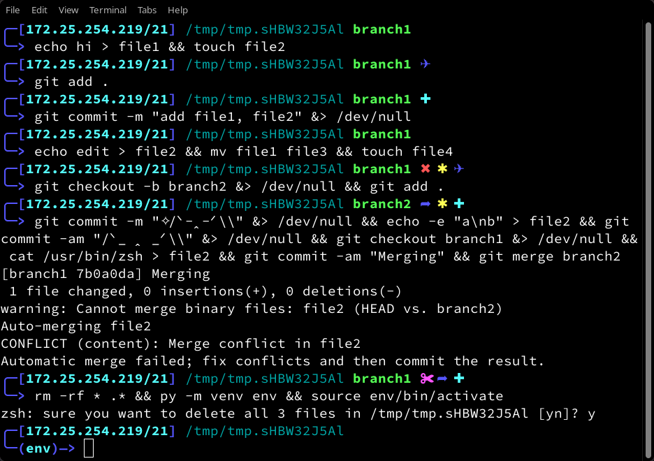

# Netmask theme

A non-intrusive, Termux-first utilitarian theme for [oh-my-zsh](https://github.com/ohmyzsh/ohmyzsh).

* IPv4 address
  * compatible with both Termux-friendly `ifconfig` and normal devices' `ip addr`
* Full directory structure
* Git branch and status
* Virtual environment
* Support for the new high-speed [async prompt](https://github.com/ohmyzsh/ohmyzsh/issues/12328#issuecomment-2043492331)



Tested on rootless Android 13+ Termux and various
desktop Linux distributions.

## Installation

Although Termux users can simply manually copy `netmask.zsh-theme` to the `$ZSH/themes` directory, it is
recommended to run the interactive installer.

```bash
$ git clone https://github.com/swomf/netmask-zsh-theme
$ cd netmask-zsh-theme
$ ./install.sh
```

The installer does the following:
* Replaces `ifconfig` calls with `ip addr` calls for
  non-Termux users
* Replaces `wlan0` with your chosen
  [Predictable Network Interface Name](https://wiki.debian.org/NetworkInterfaceNames#THE_.22PREDICTABLE_NAMES.22_SCHEME)
  (if needed)
* Ensures that permissions are set correctly for
  non-Termux users

## Attribution

* [rkj-repos zsh theme](https://github.com/ohmyzsh/ohmyzsh/blob/master/themes/rkj-repos.zsh-theme) (MIT)
* [heapbytes zsh theme](https://github.com/heapbytes/heapbytes-zsh) (MIT)
